## Links for final presenation materials

[1. Ten-mintues video](https://youtu.be/dUw60L4Zrfs)

[2. Complete slides](https://drive.google.com/file/d/1KgWovtJjX2aVMqDfxjEHYC6Xi1H0xB5b/view?usp=drive_link)

## How to run the workflow

1. Install all the required python libraries by

`pip install -r requirements.txt`

2. Run the following command 

`sh run.sh`

## Project Description
Patch-seq is a powerful technique that integrates single-cell transcriptomics with neuronal morphology and electrophysiology, enabling a comprehensive understanding of neuronal diversity. While single-cell RNA sequencing has revolutionized neuroscience by uncovering gene expression patterns across individual neurons, the complexity of neuronal function often requires a multi-modal approach. By embedding Patch-seq cells into a single-nuclei transcriptomic space, we study neuronal identity using transcriptomic profiles. This integration allows for a more reliable characterization of neuronal subtypes. 
As an ultimate goal, we aim to bridge the gap between electrophysiological measurements that are traditionally used by neuroscientists to study neuronal activity, and transcriptomic profiles which provide insights into gene expression, by linking their electrical properties to molecular identities and advancing our understanding of brain function. 

## Motivations
The primary motivation is to determine the cells types of our data. In a bigger scheme, this would help bridge the gap between the electrophysiological measurements that neuroscientists use with the transcriptomic measurements that we rely on in genomics.
For cells that are biophysically and transcriptionally homogeneous, there may be a developmental change in their transcriptomic state. And transcriptomically similar cells may also differ in terms of morphology and electrophysiology ([Reference](https://www.jneurosci.org/content/41/5/937)). 
We probably can find something intriguing from our 36 cells data when embedded into the space of ~10k single cells (nucleus). 
First of all, it involves a clustering/classification task: we determine the cell types of either patch-seq cells or snRNA-seq cells by their cluster/category. 
Second of all, it would be interesting if two cells that belong to two totally different cell types A and B are very close to each other in the embedding space. And likewise, if the distance of Cell A - another Cell A is further than the distance of Cell A - Cell B, this may indicate those cells A are in different transcriptomic states though they still have similar biophysical properties. 
Also, this research will be more complete if we can have electric-physical data of patch-seq cells. With the Multimodal Patch-seq data, we can train a machine learning algorithm to predict the functional state of cells collected from independent scRNA-seq datasets. (We don't have access to the electric-physical data yet)

## Data 
* Data were collected from Macaca Mulatta (a kind of monkey).
* Data availability
	* RNA-seq counts data of 36 cells from different regions of 7 (4F + 3M) individuals (details of individuals at `meeks/agg_metadata.csv`), with counts data of 25,432 genes. 
	* snRNA-seq counts data (**extremely sparse**) of 27,964 cells from 2 individuals, with 19,605 genes involved (download the file from this [link](https://drive.google.com/file/d/17wdUNMDrk_AGIX44MOa9itZobufrxgy8/view?usp=drive_link)). 
	* Reasoning of difference in read counts: Patch-seq captures RNA in the whole cell while snRNA-seq captures only nuclear RNA, which has fewer transcripts per cell. Meanwhile, Patch-seq often has much deeper sequencing per cell than snRNA-seq. Since snRNA-seq is typically performed on thousands of cells simultaneously, reads are distributed across many cells, leading to lower counts per cell, while Patch-seq focuses on individual cells with deeper sequencing. 
- Data Overview by brain regions and age categories

| Brain Region                     | Total  | patch-seq | snRNA-seq |
| -------------------------------- | ------ | --------- | --------- |
| V1 (Primary Visual Cortex)       | 10,627 | 5         | 10,622    |
| LPFC (Lateral Prefrontal Cortex) | 9,210  | 15        | 9,195     |
| ACC (Anterior Cingulate Cortex)  | 8,163  | 16        | 8,147     |
|                                  | 28,000 | 36        | 27,964    |

| Age Category | Total  | patch-seq | snRNA-seq |
| ------------ | ------ | --------- | --------- |
| YOUNG        | 14,352 | 27        | 14,325    |
| OLD          | 13,648 | 9         | 13,639    |
|              | 28,000 | 36        | 27,964    |
## Workflow
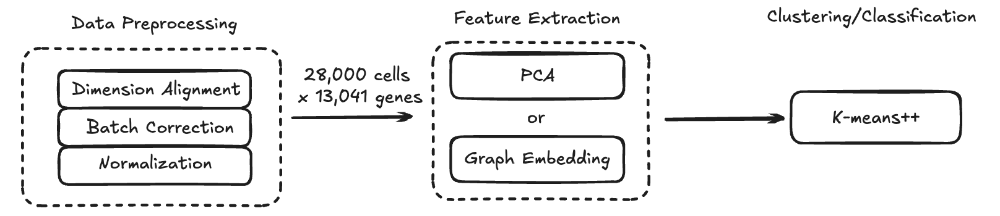

## Data Preprocessing
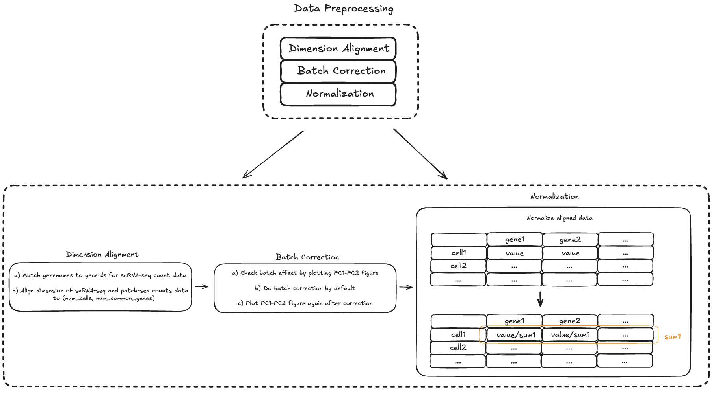

- **Dimension alignment**:
	- 19,605 (geneids + genenames) in snRNA-seq counts data 
	- 35,432 geneids in patch-seq counts data
	- Refer to `gene_mapping_m_from_id_to_ens.txt` for replacing gene names in snRNA-seq data with their corresponding gene IDs
	- Align the dimensions of the two datasets by removing unique genes/geneids in each dataset and keeping the common ones.
	- 13,041 common genes after alignment. 
- **Batch effect checking**:
	- Since we have two different batches of snRNA-seq, and also we need to integrate the patch-seq cells data with the snRNA-seq cells data to make them comparable in the embedding space, we need to check batch effect and if necessary, do batch corrections (in the code we do it by default).
		- We have two options in this section: either involving the patch-seq cells data or not when we're doing batch correction on the snRNA-seq cells data. In another word, we **may nor may not consider the 36 patch-seq cells as the third batch**. The benefit to involve patch-seq cells is better for data integrations - making patch-seq cells and snRNA-seq cells more comparable in a single embedding space. 
		- Batch correction by **NMF (non-negative matrix factorization)**: NMF is particularly well-suited for sparse, non-negative data like scRNA-seq/snRNA-seq data. It only works with non-negative values, and extracts biologically meaningful signals by factorizing the count matrix into interpretable components, and thus preserves non-negativity for gene expression data. 
			- How NMF works
			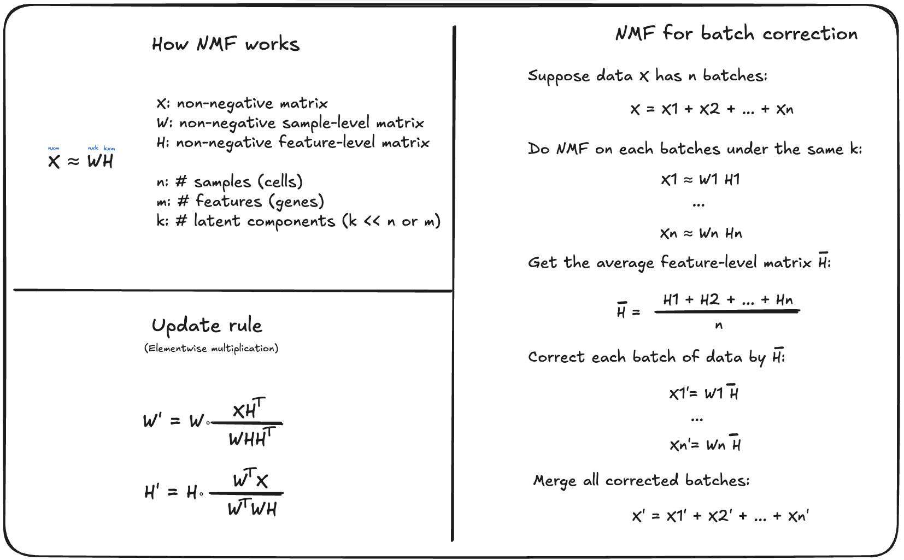
			- The hyper-parameter `n_components` must be chosen carefully. We implemented a function to aim to find the minimum number of components that explain at least 90% of variance per batch (if not exceeding the max_components we set which is 9999 in default). 
			- However, given the size of our data is huge (28k cells x 19k genes in snRNA-seq counts data before dimension alignment), and NMF is using iterative, non-convex optimization, so it can be very computationally expensive and time consuming. 
			- Tricks to make the program run faster: 1) Parallelizing code to make it run faster: use all available CPU cores for batch-level parallelism. We use 4 cores (slots) in parallel, each with at least 8 GB of memory. 2) Using incremental NMF (`MiniBatchNMF` in `scikit-learn`) instead of standard NMF: MiniBatchNMF is a variant of NMF to handle large-scale datasets efficiently. It processes data in small batches (mini-batches) instead of loading the entire dataset into memory. Its memory-efficient nature, lower computational cost and faster convergence  per iteration, and compatibility with paralleled processing makes it much faster than standard NMF. 
			- Overfitting resulting from data sparsity and solution: when the `n_components` gets larger, two batches cluster more separately, indicating the batch effect gets worse. Also, Silhouette scores become higher with `n_components` increasing. That's quite the opposite as we expected - generally with a bigger n_components, the more data variance we cover and the batch correction should have been better. In another way of thinking, it's making sense. Because our snRNA-seq counts are extremely sparse, which means with only a very few of components we can capture the majority of info from non-zero counts. And a higher `n_component` would cover more zero-counts and leading to a very high level of overfitting, which causes a worse batch effect and much higher Silhouette scores. So setting the n_components at 5 or 10 for MiniBatchNMF would be better. 
		- Batch correction by **Harmony**:  Given our snRNA-seq data are extremely sparse (dominated  by zero counts), and harmony can introduce negative values (which aren't biologically meaningful) after correction, we need to handle that where  setting negative values to zero is a common approach to ensure non-negativity. However, removing negative values leads to a high sparsity of corrected data and it doesn't work well with downstream tasks like PCA where at least 5,000 PCs are required to cover 80% of variance.  
	- To check the correction performance, perform PCA on the data and draw the PC1-PC2 figure before and after batch correction. The plots are colored by batch. If the batch clusters distribute more evenly after correction, it likely suggests a low batch effect. But keep in mind that the PC1-PC2 plot may not be informative enough to tell if the the corrected data mix more evenly because two first PCs only cover a part of data variance. To quantify the corrected results, we calculate Silhouette Score which measures the separation level of batches and should decrease after batch correction. A lower non-negative Silhouette score after correction means lower batch effects. 
		* Silhouette score for a data point $i$:
			* Intra-cluster distance $a(i)$: the average distance between $i$  and all other points in the same cluster.
			* Inter-cluster distance $b(i)$: the average distance between $i$ and all points in the nearest other cluster.
			* Formula of Silhouette score:  
			$$s(i) = \frac{b(i) - a(i)}{\max(a(i), b(i))} \in (-1, 1)$$

		     - $s(i)$  Close to 1: Well-clustered, compact, and well-separated.
		     - $s(i)$ Close to 0: Near the decision boundary between clusters.
		     - $s(i)$ Close to -1: Likely misclassified, should belong to another cluster.
		* Overall Silhouette Score (the average silhouette coefficient over all points): 
		$$S = \frac{1}{N} \sum_{i=1}^{N} s(i)\in (-1, 1)$$
		
		* It turns out the optimal n_components would be 5 given by a lower non-negative value of Silhouette score after batch correction, either involving the patch-seq cells as the third batch or not. 
			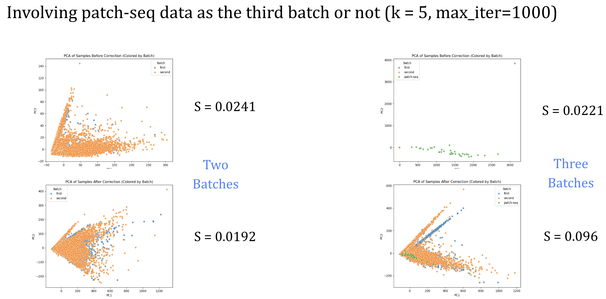
			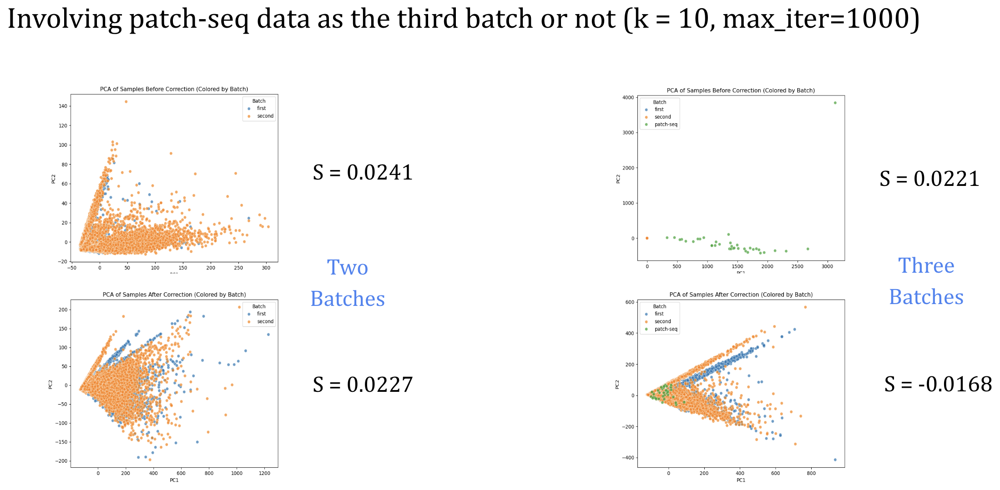
- **Normalization**:
	- After dimension alignment, normalize the data by summing up gene expression counts within each cell (row), and divide each count data in the row by the sum.  
	- This step is to make the data comparable across different cells because gene expression levels can vary significantly for different cells.
	- Why we do normalization after batch correction instead of doing it before? 
		* Batch correction often relies on detecting and adjusting systematic differences between batches, and performing normalization before batch correction can mask these differences, making batch correction ineffective.
		- We synthesized two batches of data (left plot). If we do NMF correction then data normalization, those batches of data would distribute more evenly and spread out (middle plot). However, if we do normalization before correction, NMF doesn't do the correction properly because normalizing the data mask their batch effects that will exist even after correction (right plot).
		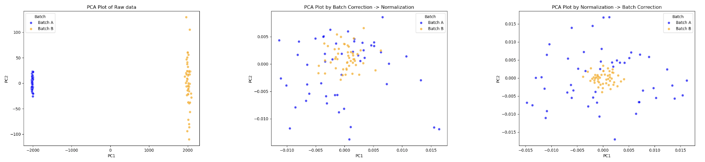

## Data Visualization
- Plotting: 
	- Distribution of dominant brain regions within each cluster: ACC, LPFC, V1
	- Distribution of dominant age group within each cluster:
		- Macaca Mulatta can be definded as young adult (6–9 years old), middle-aged (15–19 years old), and older adult (26–30 years old) [(Reference)](https://pubmed.ncbi.nlm.nih.gov/8862195/).  
		- In this study, we define individuals under 15 years old as young, otherwise old. 
	- Distribution of raw gene counts (before data preprocessing) within each cluster
	- First two features: PC1-PC2 on PCA results, and embedding_dim_1-embedding_dim_2 for graph embedding results
	- Distribution of cell type annotations using built-in algorithms in Seurat  within each cluster
- K-means clustering (based on **Euclidean distance**)
	- Perform K-means clustering on the PCA results or embedded vectors. Draw the K-means clustering plot in 2D under different k. 
	- Involving patch-seq cells as the third batch at batch correction is essential to integrate and embed heterogeneous datasets in the same space. Originally extremely sparse snRNA-seq data has became comparable when we involve patch-seq data as the third batch during batch correction. In this sense, they integrate with each other in the same transcriptomic space. 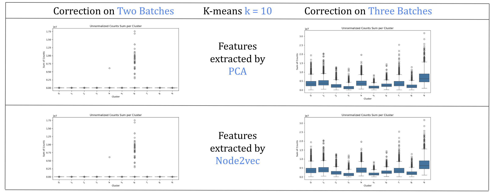
	- To find the optimal k with the best clustering result
		- Look for the k that maximize Silhouette score: the larger the  Silhouette score, the better separation of clusters: point are better-clustered, closer to its own cluster, and further away from others. 
		- Look for the elbow point of Within-cluster sum of squares (WCSS, or intertia) under different k. 
		
			$$WCSS= \sum_{i=1}^{k} \sum_{x_j \in C_i} \| x_j - \mu_i \|^2$$

			Where: 
			- $C_i$: Cluster $i$
			- $\mu_i$: Centroid of cluster $i$
			- $\| x_j - \mu_i \|$: Euclidean distance between a point and its cluster center

			As $k$ increases, WCSS always decreases (more clusters causes points closer to centers). However, the rate of decrease slows down. The elbow point is where the marginal gain (reduction in WCSS) drops sharply. After this point, adding more clusters doesn't significantly improve the clustering. The elbow point represents the point of diminishing returns and gives a balance between model simplicity and data fit.
		- Optimal k of K-means by features from PCA (3 batches for correction during data preprocessing): 5, or 10 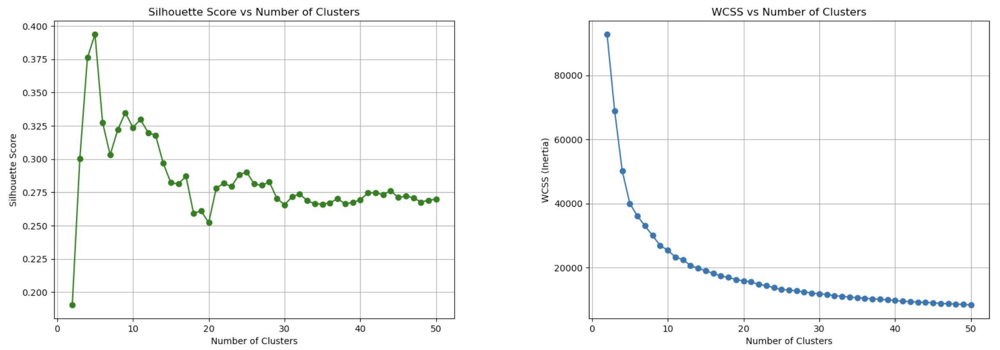
		- Optimal k of K-means by features from Node2vec (3 batches for correction during data preprocessing): 5, or 10 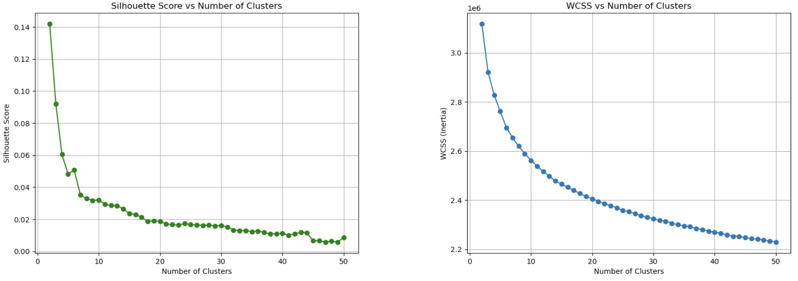
	- Plots of first 2 dimensions
		- PCA 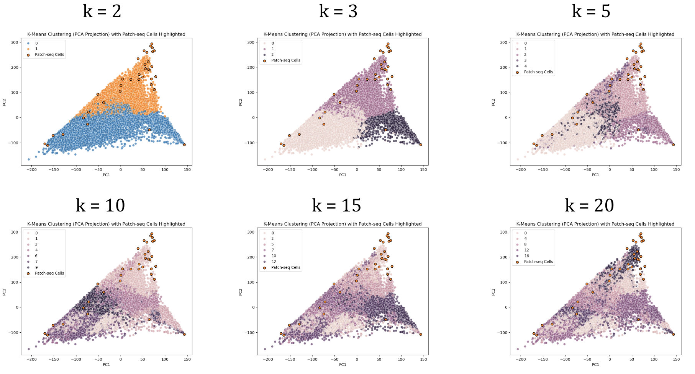
		- Node2vec 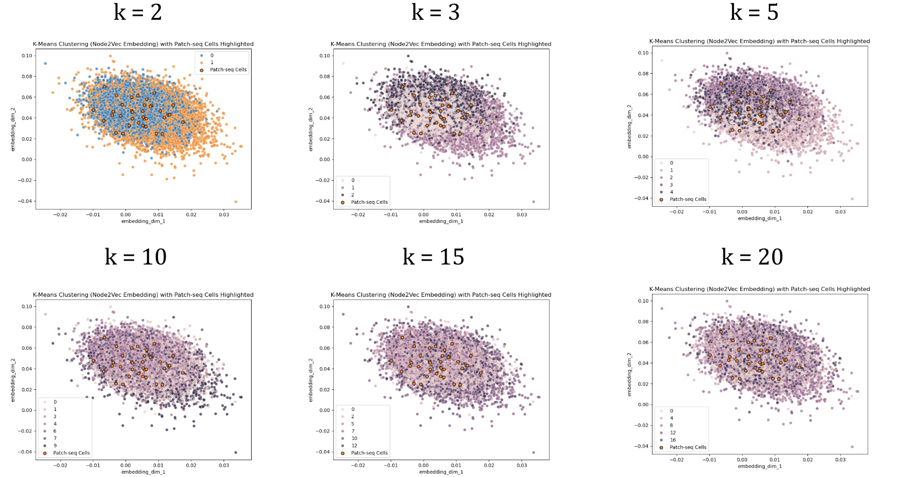
	- Boxplot of sum of gene counts distribution within each cluster
		- PCA 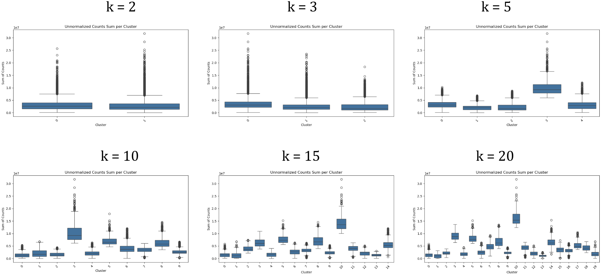
		- Node2vec 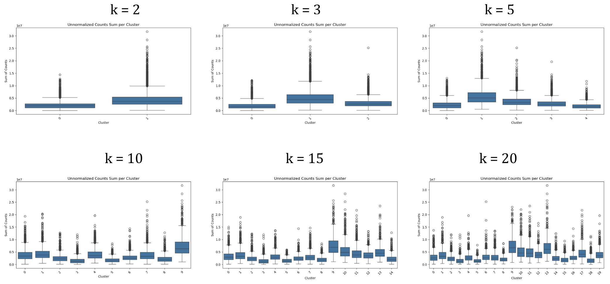
	- Boxplot of Seurat cell type annotation distribution within each cluster
		- PCA 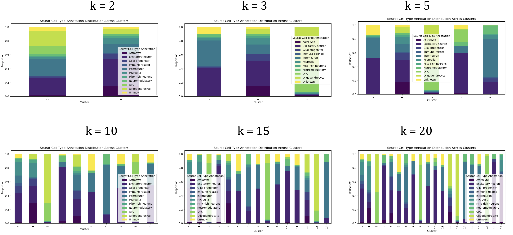
		- Node2vec 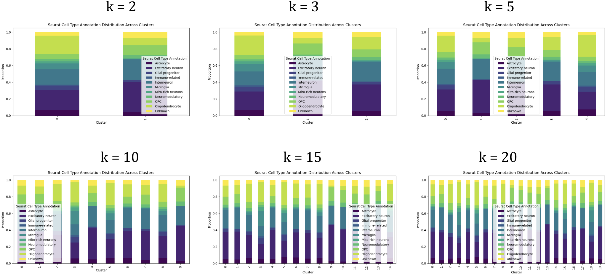
		- Number of dominant Seurat cell type annotation for 36 Patch-seq cells
			- Features extracted by PCA 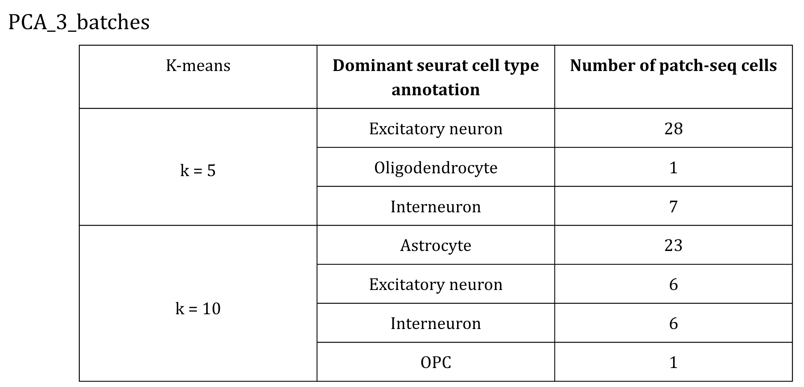
			- Features extracted by Node2vec 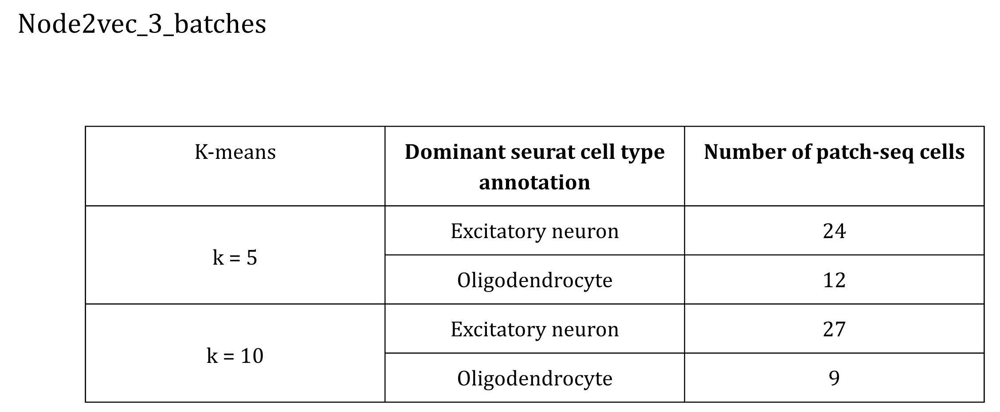

